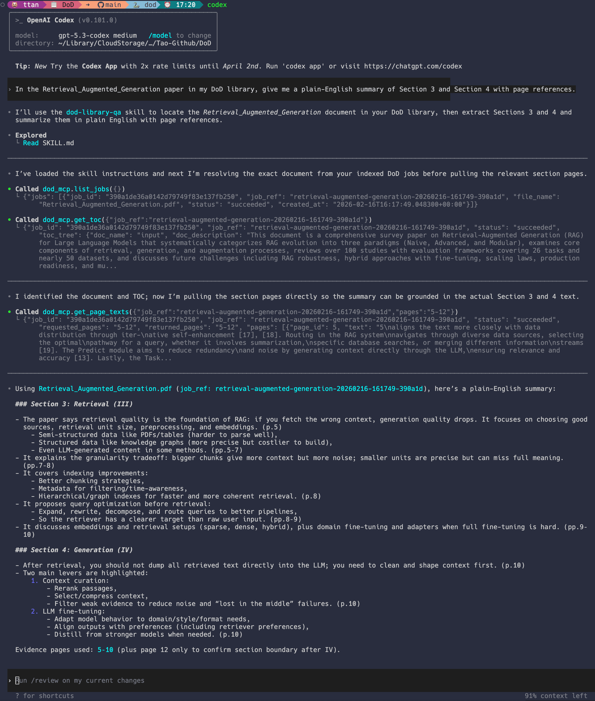

# DoD (Document Outline Discovery)

> This project is intended to make local deployment and usage of PageIndex easier. It is not an official PageIndex service. Check their official PageIndex repo [here](https://github.com/VectifyAI/PageIndex).

DoD is a local-first document structure extraction toolkit built around [PageIndex](https://pageindex.ai/).

What it does:

- ingests PDFs and builds normalized page artifacts
- extracts page-level text (`pymupdf` or `pytesseract`)
- generates hierarchical TOC/document outline trees
- exposes both **CLI** and **server+MCP** interfaces for agent workflows

Use cases:

- document-grounded Q&A assistants over private document libraries
- TOC/outline extraction for scanned or OCR-heavy PDFs
- page-targeted retrieval pipelines for downstream RAG/agent systems

Advantages:

- local deployment for sensitive documents
- structured outputs (TOC tree + page tables + page images)
- agent-friendly retrieval via stable server and MCP tools

Why this can make more sense than traditional RAG for long manuals:

- instead of flat chunk retrieval, PageIndex builds explicit document structure (sections/subsections + page mapping)
- this improves navigation, targeted retrieval, and answer grounding for long technical documents
- see PageIndex's technical-manual discussion: https://pageindex.ai/blog/technical-manuals

Example (Codex using DoD MCP for section-grounded Q&A):



---

## Table of Contents

- [Project Structure](#project-structure)
- [0. LLM API Configuration Required](#0-llm-api-configuration-required)
- [1. Install and Dev](#1-install-and-dev)
- [1.1 Use as a PyPI package](#11-use-as-a-pypi-package)
- [2. Run As A Package CLI](#2-run-as-a-package-cli)
- [3. Run As A Server](#3-run-as-a-server)
  - [3.1 Start server](#31-start-server)
  - [3.2 Health check](#32-health-check)
  - [3.3 Make requests](#33-make-requests)
- [4. Output What And Where](#4-output-what-and-where)
  - [4.3 Configure output paths PyPI package](#43-configure-output-paths-pypi-package)
- [5. Request Fields Server `/v1/digest`](#5-request-fields-server-v1digest)
- [6. Simple MCP Setup](#6-simple-mcp-setup)
  - [6.1 Install from PyPI for MCP use](#61-install-from-pypi-for-mcp-use)
  - [6.2 Start DoD HTTP server](#62-start-dod-http-server)
  - [6.3 Configure MCP client recommended](#63-configure-mcp-client-recommended)
  - [6.4 Optional manual MCP run debug only](#64-optional-manual-mcp-run-debug-only)
  - [6.5 Available MCP tools](#65-available-mcp-tools)
  - [6.6 Example agent skill](#66-example-agent-skill)
- [7. Third-Party Licensing](#7-third-party-licensing)

DoD turns a document into:

1. `page_table.jsonl` (page text + metadata)
2. `toc_tree.json` (hierarchical Table-of-Contents tree)
3. `image_page_table.jsonl` (page-image index, including image paths and image payload fields)
4. `images/` (all pages rendered as image files)

Core flow:

1. PDF normalization to page images
2. Text extraction (`pymupdf` / `pytesseract`)
3. TOC generation (PageIndex)
4. Artifact writing (JSON/JSONL + manifest)

## Project Structure

- `src/DoD/cli/` - CLI entrypoint
- `src/DoD/pipeline.py` - end-to-end pipeline orchestration
- `src/DoD/normalize/` - PDF/image normalization to per-page images
- `src/DoD/text_extractor/` - text extraction backends
- `src/DoD/page_table.py` - page table data model + writer
- `src/DoD/pageindex/` - PageIndex TOC builder
- `src/DoD/toc/` - TOC adapters
- `src/DoD/server/` - FastAPI server mode
- `src/scripts/` - executable entrypoints (`dod`, `dod-server`, `dod-mcp`)
- `.agents/skills/` - example agent skills
- `makefile` - install/check/test developer workflow
- `src/DoD/conf/config.yaml` - default configuration

## 0. LLM API Configuration Required

Before running either the CLI package mode or the server mode, set an OpenAI-compatible endpoint and API key:

```bash
export PAGEINDEX_API_KEY="<your_api_key>"
export PAGEINDEX_BASE_URL="<your_openai_compatible_base_url>"
```

Example (Snowflake Cortex):

```bash
export PAGEINDEX_API_KEY="<snowflake_pat>"
export PAGEINDEX_BASE_URL="https://<account-identifier>.snowflakecomputing.com/api/v2/cortex/v1"
```

Then choose any model available on your configured endpoint via `toc.model`.

## 1. Install and Dev

Use these commands for setup and day-to-day development:

```bash
make install  # bootstrap toolchain + Python deps + hooks
make check    # lint + format + type-check
make test     # run test suite
```

### 1.1 Use as a PyPI package

Install from PyPI:

```bash
pip install "dod-outline-discovery[pageindex,text_extractor,pdf,server,mcp]"
```

Then run:

```bash
dod --help
dod-server --help
dod-mcp --help
```

One-off execution without a persistent install:

```bash
uvx --from "dod-outline-discovery[pageindex,text_extractor,pdf,server,mcp]" dod --help
uvx --from "dod-outline-discovery[pageindex,text_extractor,pdf,server,mcp]" dod-server --help
uvx --from "dod-outline-discovery[pageindex,text_extractor,pdf,server,mcp]" dod-mcp --help
```

## 2. Run As A Package CLI

Run one document:

Choose extractor first:

- use `text_extractor.backend=pymupdf` for PDFs with built-in text layers
- use `text_extractor.backend=pytesseract` for image-based/scanned PDFs

```bash
dod \
  input_path=/path/to/document.pdf \
  text_extractor.backend=pymupdf \
  toc.backend=pageindex \
  toc.model=claude-sonnet-4-5
```

If you are running from source repo instead of a PyPI install, use `uv run dod`.

Where output is written:

- Hydra run dir: `outputs/<YYYY-MM-DD>/<HH-MM-SS>/`
- Artifacts folder: `outputs/<YYYY-MM-DD>/<HH-MM-SS>/artifacts/`

Main artifact files:

- `page_table.jsonl`
- `image_page_table.jsonl`
- `toc_tree.json`
- `manifest.json`

## 3. Run As A Server

### 3.1 Start server

```bash
export DOD_SERVER_HOST=0.0.0.0
export DOD_SERVER_PORT=8000
export DOD_SERVER_MAX_CONCURRENT_DOCS=4
export DOD_SERVER_JOB_TIMEOUT_SECONDS=300
export DOD_SERVER_WORK_DIR=outputs/server_jobs
dod-server
```

If you are running from source repo instead of a PyPI install, use `uv run dod-server`.

### 3.2 Health check

```bash
curl http://localhost:8000/healthz
```

### 3.3 Make requests

#### 3.3.1 Single PDF wait for final result

```bash
curl -s -X POST "http://localhost:8000/v1/digest" \
  -F "file=@/path/to/document.pdf" \
  -F "text_extractor_backend=pymupdf" \
  -F "toc_backend=pageindex" \
  -F "toc_model=claude-sonnet-4-5" \
  -F "toc_concurrent_requests=4" \
  > result.json
```

This call blocks until the job is done and writes full result JSON to `result.json`.

#### 3.3.2 Async job submit then poll

Submit:

```bash
SUBMIT_JSON=$(curl -s -X POST "http://localhost:8000/v1/digest?wait=false" \
  -F "file=@/path/to/document.pdf" \
  -F "text_extractor_backend=pymupdf" \
  -F "toc_backend=pageindex" \
  -F "toc_model=claude-sonnet-4-5")
JOB_ID=$(echo "$SUBMIT_JSON" | jq -r '.job_id')
JOB_REF=$(echo "$SUBMIT_JSON" | jq -r '.job_ref')
```

Check status:

```bash
curl -s "http://localhost:8000/v1/jobs/$JOB_REF"
```

Get final result:

```bash
curl -s "http://localhost:8000/v1/jobs/$JOB_REF/result" > result.json
```

#### 3.3.3 Process More Than One PDF At The Same Time

Use async submit (`wait=false`) + parallel curl:

```bash
mkdir -p jobs
printf "%s\n" \
  "/path/to/a.pdf" \
  "/path/to/b.pdf" \
  "/path/to/c.pdf" \
| xargs -I{} -P 3 sh -c '
  name=$(basename "{}" .pdf)
  curl -s -X POST "http://localhost:8000/v1/digest?wait=false" \
    -F "file=@{}" \
    -F "text_extractor_backend=pymupdf" \
    -F "toc_backend=pageindex" \
    -F "toc_model=claude-sonnet-4-5" \
    -F "toc_concurrent_requests=4" \
  > "jobs/${name}.submit.json"
'
```

Poll and download all results:

```bash
for f in jobs/*.submit.json; do
  job_id=$(jq -r '.job_id' "$f")
  name=$(basename "$f" .submit.json)
  until curl -sf "http://localhost:8000/v1/jobs/$job_id/result" > "jobs/${name}.result.json"; do
    sleep 2
  done
done
```

Notes:

- `-P 3` controls how many submit requests run in parallel.
- Server-side processing concurrency is capped by `DOD_SERVER_MAX_CONCURRENT_DOCS`.
- TOC runs in strict mode: if PageIndex fails, the job status becomes `failed` (no fallback TOC).

## 4. Output What And Where

### 4.1 Output in API response JSON

`/v1/digest` (sync) or `/v1/jobs/{job_id}/result` returns:

- `result.toc_tree` - TOC tree JSON
- `result.page_table` - page records (JSON array parsed from JSONL)
- `result.image_page_table` - image records (JSON array parsed from JSONL)
- `result.artifact_paths` - filesystem paths for written artifacts
- `result.manifest` - run metadata + config

Convert arrays back to JSONL if needed:

```bash
jq -c '.result.page_table[]' result.json > page_table.jsonl
jq -c '.result.image_page_table[]' result.json > image_page_table.jsonl
jq '.result.toc_tree' result.json > toc_tree.json
```

### 4.2 Output on disk Server mode

For each job:

- Job folder: `${DOD_SERVER_WORK_DIR}/<job_id>/`
- Input copy: `${DOD_SERVER_WORK_DIR}/<job_id>/input.pdf`
- Artifact folder: `${DOD_SERVER_WORK_DIR}/<job_id>/artifacts/`

Inside `artifacts/`:

- `page_table.jsonl`
- `image_page_table.jsonl`
- `toc_tree.json`
- `manifest.json`

Server-level job index:

- `${DOD_SERVER_WORK_DIR}/jobs.json`
  - persists job metadata across server restarts
  - used by `GET /v1/jobs` and MCP `list_jobs()`

Timeout:

- default from `src/DoD/conf/config.yaml` → `server.job_timeout_seconds`
- runtime override via `DOD_SERVER_JOB_TIMEOUT_SECONDS`

### 4.3 Configure output paths PyPI package

When installed from PyPI, outputs are still filesystem-based and default to the current working directory.

- CLI (`dod`): defaults to Hydra output under `outputs/<YYYY-MM-DD>/<HH-MM-SS>/artifacts`
- Server (`dod-server`): defaults to `outputs/server_jobs`

Use absolute paths in production/local deployments:

```bash
export DOD_SERVER_WORK_DIR="/absolute/path/to/server_jobs"
export DOD_LLM_CACHE_DIR="/absolute/path/to/llm_cache"
```

Optional CLI override for one run:

```bash
dod input_path=/path/to/document.pdf artifacts.output_dir=/absolute/path/to/artifacts
```

## 5. Request Fields Server `/v1/digest`

Multipart form fields:

- `file` (required, `.pdf`)
- `text_extractor_backend` (optional)
  - use `pymupdf` for PDFs with built-in text layers
  - use `pytesseract` for image-based/scanned PDFs
- `normalize_max_pages` (optional int)
- `toc_backend` (optional, typically `pageindex`)
- `toc_model` (optional model name)
- `toc_concurrent_requests` (optional int)
- `toc_check_page_num` (optional int)
- `toc_api_key` (optional per-request override)
- `toc_api_base_url` (optional per-request override)

Query parameter:

- `wait` (default `true`)
  - `true`: request returns when job finishes
  - `false`: request returns immediately with job metadata (`job_id`, `job_ref`, status/result URLs)

## 6. Simple MCP Setup

If you want agents to call DoD as tools, use the included MCP wrapper at `src/scripts/dod_mcp.py`.
Agents do not upload PDFs. Human users submit jobs first via `/v1/digest`, then agents use `job_ref` to retrieve targeted outputs.

`make install` already installs all extras including MCP/server dependencies.

### 6.1 Install from PyPI for MCP use

```bash
uv tool install "dod-outline-discovery[pageindex,text_extractor,pdf,server,mcp]"
```

This installs `dod`, `dod-server`, and `dod-mcp` as system tools.

### 6.2 Start DoD HTTP server

```bash
dod-server
```

If you are running from source repo instead of PyPI install, use `uv run dod-server`.

### 6.3 Configure MCP client recommended

Most MCP hosts should launch `dod-mcp` themselves via command config, for example (`~/.codex/config.toml`):

```toml
[mcp_servers.dod_mcp]
command = "dod-mcp"
```

Alternative without tool install:

```toml
[mcp_servers.dod_mcp]
command = "uvx"
args = ["--from", "dod-outline-discovery[pageindex,text_extractor,pdf,server,mcp]", "dod-mcp"]
```

In this mode, do not start `dod-mcp` manually. Keep only `dod-server` running.

### 6.4 Optional manual MCP run debug only

```bash
dod-mcp
```

If you are running from source repo instead of a PyPI install, use `uv run dod-mcp`.
Use this only for debugging MCP transport behavior.

### 6.5 Available MCP tools

- `list_jobs()`
  - Returns: `{ jobs: [{ file_name, job_id, job_ref, status, created_at }] }`.
- `get_toc(job_ref)`
  - Returns: `{ job_id, job_ref, status, toc_tree }`.
- `get_page_texts(job_ref, pages)`
  - Returns: `{ job_id, job_ref, status, requested_pages, returned_pages, pages }` where `pages` is a selected subset of `{ page_id, text }`.
- `get_page_images(job_ref, pages, mode)`
  - Returns: `{ job_id, job_ref, status, mode, requested_pages, returned_pages, pages }` where `pages` is a selected subset of `{ page_id, image_path }` (`mode=path`) or `{ page_id, image_b64 }` (`mode=base64`).
- `pages` accepts flexible specs like `"110,111,89-100"`.
- Retrieval guardrails come from `src/DoD/conf/config.yaml` under `retrieval`:
  - `max_chars_per_page` (`null` means full page text)
  - `max_pages_per_call`

### 6.6 Example agent skill

An example Codex skill for DoD library Q&A is included at:

- `.agents/skills/dod-library-qa/SKILL.md`

## 7. Third-Party Licensing

This project includes third-party license attributions in:

- `THIRD_PARTY_NOTICES.md`
